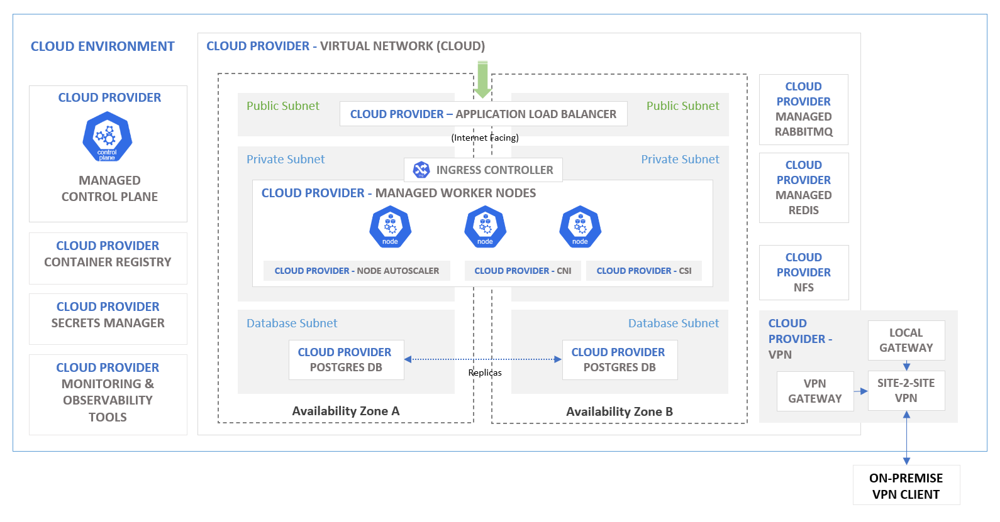

# Kubernetes in Hybrid Cloud

Terraform templates to create a kubernetes cluster on the Cloud with supporting services and also site-to-site VPN connectivity back to an on-premise environment. The environment is only good for testing/learning purposes, therefore, please make the necessary changes if you want to use it for production.

  

You are required to configure the required cloud provider cli and account on your machine before using these templates.

Supported Cloud Provider Kubernetes environment:
* Amazon Elastic Kubernetes Service (EKS)
* Microsoft Azure Kubernetes Service (AKS)
* Alibaba Container Services for Kubernetes (ACK)

> [!NOTE]
> Please run the `terraform` commands in the specific cloud provider's folder.

## Disclaimer
Everything provided here is 'as-is' and comes with no warranty or support.